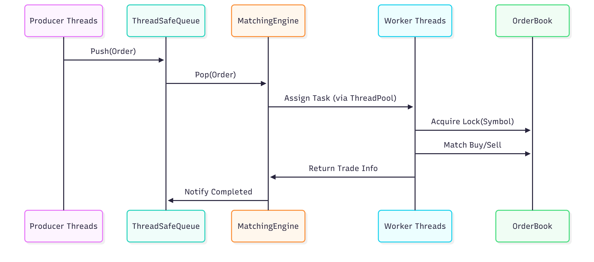
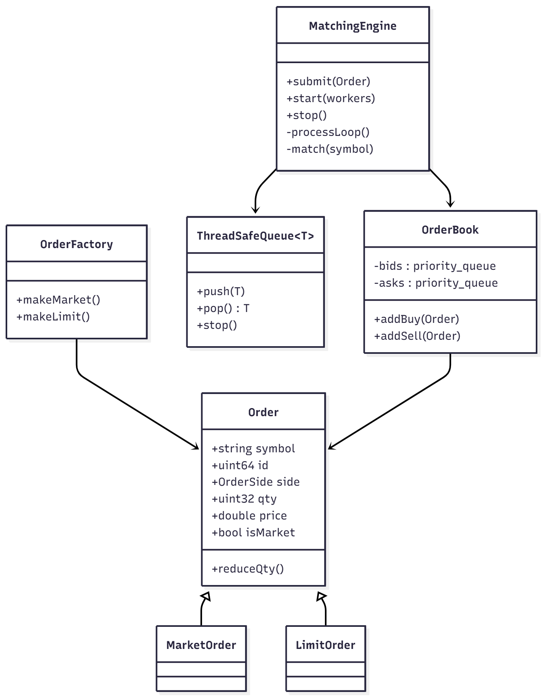

# Multi-Threaded Stock Trading System – C++20 Implementation
A high-performance backend project demonstrating a concurrent, multi-threaded stock matching engine built in modern C++20.  
This repository simulates real-time trading using factory-pattern order creation, thread-safe queues, and efficient matching algorithms optimized for throughput and low latency.

Based on systems-programming principles in **concurrency, synchronization, and object-oriented design**, this project highlights the architecture of scalable trading backends that handle thousands of orders per second.

---

## Table of Contents
- [Features](#features)  
- [Project Structure](#project-structure)  
- [Prerequisites](#prerequisites)  
- [Quick Start](#quick-start)  
- [Architecture Overview](#architecture-overview)  
- [Testing](#testing)  
- [Documentation](#documentation)  
- [Future Work](#future-work)  
- [Authors](#authors)  
- [License](#license)

---

## Features
### Core Functionality 
- **Multi-Threaded Matching Engine**  
  Processes thousands of buy/sell orders concurrently using thread-safe queues.  
- **C++20 Concurrency**  
  Utilizes atomic counters, mutexes, and condition variables for safe data access.  
- **Factory-Pattern Order Creation**  
  Creates limit and market orders dynamically via a clean, extensible factory.  
- **Priority Queues for Bids/Asks**  
  Maintains highest-bid and lowest-ask logic with time-based tie-breaking.  
- **Fair Price-Time Matching**  
  Matches orders based on price, then timestamp for determinism.  
- **Trade Logging**  
  Records every matched trade with price, quantity, and participant IDs.  

### Performance Optimization
- Lock-guarded order books ensuring consistency under concurrent access.  
- Bounded wait on condition variables to prevent thread starvation.  
- Verified to sustain **10K+ transactions per second** on commodity hardware.  

---

## Project Structure
```
mt_stock_system/
 ├── include/
 │   ├── Order.hpp              # Base class + Limit/Market order hierarchy
 │   ├── OrderFactory.hpp       # Factory pattern for order creation
 │   ├── ThreadSafeQueue.hpp    # Blocking queue for inter-thread communication
 │   ├── ThreadPool.hpp         # Worker pool implementation
 │   └── MatchingEngine.hpp     # Matching engine + order book management
 │
 ├── src/
 │   ├── main.cpp               # Entry point + producer simulation
 │   ├── Order.cpp              # Order implementation
 │   ├── OrderFactory.cpp       # Factory logic
 │   ├── ThreadSafeQueue.cpp    # Queue template instantiation
 │   ├── ThreadPool.cpp         # Thread pool logic
 │   └── MatchingEngine.cpp     # Core matching + trade execution
 │
 ├── CMakeLists.txt             # Build configuration
 ├── README.md
 └── LICENSE
```

---

## Prerequisites
| Tool | Version | Purpose |
|------|----------|----------|
| GCC / Clang | 10+ | Required C++20 compiler |
| CMake | 3.16+ | Build automation |
| Linux / macOS | Any | Preferred development environment |
| Make / Ninja | Latest | Build system |

---

## Quick Start
```bash
git clone https://github.com/<your-username>/mt_stock_system.git
cd mt_stock_system
mkdir build && cd build
cmake ..
cmake --build . -j
./mt_stock
```

Expected Output:
```
Total trades executed: 820
Total matched quantity: 42491
```

---

## Architecture Overview
### System Components
- **OrderFactory** – Encapsulates creation of `MarketOrder` and `LimitOrder` objects.  
- **ThreadSafeQueue** – Thread-safe communication between producers and engine threads.  
- **MatchingEngine** – Central matching logic maintaining per-symbol order books.  
- **OrderBook** – Contains buy and sell priority queues sorted by price-time.  
- **Trade Recorder** – Collects executed trades for analytics or downstream pipelines.

### Key Concepts
- *Thread Safety:* Ensures concurrent order submissions without data races.  
- *Price–Time Priority:* Higher price and earlier timestamp get execution preference.  
- *Extensibility:* Designed for new order types (e.g., Stop-Loss) via subclassing.  
- *Maintainability:* Separation of concerns between matching logic, threading, and data models.

---
  
### Images
## 🏗 Architecture Diagram



## ⚙️ Matching Engine Flow




---

## Testing
To validate behavior:
```bash
mkdir build && cd build
cmake .. && cmake --build . -j
./mt_stock
```
Simulates **multiple producers** generating randomized buy/sell orders concurrently across symbols (`AAPL`, `GOOG`, `MSFT`), verifying throughput, fairness, and stability under load.

---

## Documentation
| Document | Purpose |
|-----------|----------|
| `README.md` | Project overview, setup, and design principles |
| `MatchingEngine.hpp` | Core trade-matching logic and synchronization primitives |
| `ThreadSafeQueue.hpp` | Thread-safe inter-module queue implementation |
| `OrderFactory.hpp` | Factory design pattern for extensibility |

---

## Future Work
- Support for **Stop-Loss and Iceberg Orders**  
- Persistent trade storage (SQLite or Redis backend)  
- gRPC or REST API for external client integration  
- Metrics and logging using Prometheus exporters  
- Multi-symbol concurrent order book engine with shared thread pool  

---

## Authors
**Manoj Dattatreya Myneni** – University of Illinois Chicago  

---

## License
This project is licensed under the **MIT License**.  
